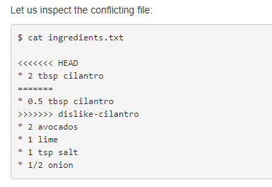
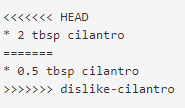

  
```{css, echo=FALSE}
.center2 {
  margin: 0;
  position: absolute;
  top: 50%;
  left: 50%;
  -ms-transform: translate(-50%, -50%);
  transform: translate(-50%, -50%);
}

.remark-slide-number {
  position: inherit;
}

.remark-slide-number .progress-bar-container {
  position: absolute;
  bottom: 0;
  height: 4px;
  display: block;
  left: 0;
  right: 0;
}

.remark-slide-number .progress-bar {
  height: 100%;
  background-color: red;
}

.final-slide {
  background-image: url("libs/imgs/AYNA3_ChrisJones.jpeg");
  background-size: cover;
}
```

```{r xaringan-themer, include=FALSE, warning=FALSE}
library(xaringanthemer)
library(here)
style_solarized_light(
  header_font_google = google_font("Josefin Sans"),
  text_font_google   = google_font("Montserrat", "300", "300i"),
  code_font_google   = google_font("Fira Mono"),
  )
```

```{r setup, include=FALSE}
knitr::opts_chunk$set(echo = FALSE)
knitr::opts_chunk$set(fig.retina = 3)
knitr::opts_chunk$set(out.width  = '100%')
library(tidyverse)
library(here)
library(knitr)
library(xaringanBuilder)
library(chromote)
#build_pdf(here("presentations", "SAFS_GSS_Git_workshop_2021.Rmd"), partial_slides = TRUE)
```

# Pre-workshop homework

--

`r icons::icon_style(icons::fontawesome("git"), scale = 1, fill = "#b58900")` Ensure you have git on your [Mac](https://happygitwithr.com/install-git.html#macos) or [Windows](https://happygitwithr.com/install-git.html#install-git-windows)

--

`r icons::icon_style(icons::fontawesome("github"), scale = 1, fill = "#b58900")` [Make a GitHub account](https://github.com/)

--

`r icons::icon_style(icons::fontawesome("r-project"), scale = 1, fill = "#b58900")` Download [R](https://cran.rstudio.com/) and [RStudio](https://www.rstudio.com/products/rstudio/download/)

--

`r icons::icon_style(icons::fontawesome("link"), scale = 1, fill = "#b58900")` [Link GitHub and RStudio](https://happygitwithr.com/connect-intro.html)

--

`r icons::icon_style(icons::fontawesome("gitkraken"), scale = 1, fill = "#b58900")` **Optional** [Download GitKraken](https://www.gitkraken.com/download)

--

`r icons::icon_style(icons::fontawesome("graduation-cap"), scale = 1, fill = "#b58900")` **Optional** [Sign up for free student resources on GitHub](https://education.github.com/pack)

---

# Outline of workshop

- Short lecture on suggested Git workflow

--

- Demos of essential skills
  - Cache git credentials
  - Cloning a repository from GitHub to your computer using RStudio
  - Stage - commit - pull - push
  - Creating branches for feature development in RStudio
  - Resolving merge conflicts
  - Editing the `.gitignore` file
  - What to do if something gets f*cked up
  
--
  
- Breakout groups to practice skills above

---

# Acknowledgements

**Adapted from ** 
- Jenny Bryan, [Happy Git with R](https://happygitwithr.com/)
- [Atlassian Git tutorials](https://www.atlassian.com/git/tutorials)

---

# Why Git + GitHub


- Git is a **version control system**. It originally helped softward developers work collaboratively to develop products. 

--

- Git manages the evolution of a set of files (i.e., **repository**). It's like Google Docs in that you can restore the status of your files from, say, a week ago. 

--

- Allows you to work from any computer (e.g., the FSH computer labs)

--

- More organized than say, saving version 1, version 2, **...** version 1000 of a single file

--

- Functions as an auxiliary back up of your code (though it should not be your **only** backup!!!!)

---

# Why **not** Git + GitHub

- Painful to get set up the first time

--

- Change in workflow

--

- If you never need to share your project with others (none of us, probably)

---

# Why Git + GitHub

.pull-left[

**Before git...**

```{r before, echo = FALSE, out.width="100%"}

```
]

--

.pull-right[

**After git...**

```{r after, echo = FALSE, out.width="100%"}
knitr::include_graphics("libs/imgs/after_git.gif")
```
]

---

# How we use Git

---

# Basic workflow

--

- Create a new repository on GitHub

--

- Make a new RStudio project (select from Version Control and follow prompts)

--

- Go about your business

--

- Periodically **commit** saved changes you've made to Git. Commits are like snapshots of the entire project.

--

- Periodically **push** those commits to GitHub. Pusing syncs the local repo with the remote repo

---

# Basic workflow

.center[
```{r git-workflow, echo = FALSE, out.width="100%"}
knitr::include_graphics("libs/imgs/Git Diagram.svg")
```
]

---

# Create a new repository on GitHub

1. In the upper-right corner of any page, use the  drop-down menu, and select New repository.

2. Type a name for your repository, and an optional description.

3. Choose a repository visibility.

.center[
```{r repo, echo = FALSE, out.width="50%"}
knitr::include_graphics("libs/imgs/create-repository-public-private.png")
```
]

- Make sure you have a student account so you can use private repositories!

---

# Create a new repository on GitHub

<ol start="4">
    <li>Add any optional items you want to pre-populate your repository with:</li>
</ol>

<UL>
<LI> README: A document describing your project
<LI> .gitignore file: which is a set of ignore rules (described more later)
<LI> software license for your project
</UL>

<ol start="5">
  <li>Click create repository</li>
</ol>

---

# Template repository

--

- What is a template repository: "A filing cabinet" repository

--

- A template repository enables users to:
  - Mark a repository as a template
  - Copy entire repository directory structure and files to a brand new repository
  - Share repository templates with other GitHub users

---

# Make and use a template repository

--

1. Create a new repository and put template in its name (e.g., project_template)

--

2. Add folders to the new repository (e.g., scripts, data, documents, presentations, etc.)

--

3. Then convert the repository as a template repository (in settings)

--

4. Create a brand new repository and use "project_template" as your template repository

--

- Let's try it out!

---

# Cache git credentials 

- When we interact with a remote Git server (GitHub) we have to include credentials to prove we are a specific GitHub user

- Git can communicate with a remote server using one of two protocols, HTTPS or SSH, and the different protocols use different credentials.

- Here we describe the credential setup for the SSH protocol. 

- HTTPS vs SSH?? read [here](https://ourtechroom.com/tech/https-vs-ssh-in-git/) or [ here](https://happygitwithr.com/https-pat.html#https-vs-ssh)

[reference 1](https://happygitwithr.com/https-pat.html)

[reference 2](https://docs.github.com/en/authentication/connecting-to-github-with-ssh/about-ssh)

---

# Check for existing SSH Keys

-FILL HERE

--- 

# Generate new SSH Key

-Add here

--- 

# Add new SSH Key

-Add here

--- 

# Test new SSH Key

-Add here
- TEST CONNECTION

--- 

# Make a new RStudio project

---

# Stage, commit, push

---

# Editing the `.gitignore` file

---

# Exercises

- Email [Abby](aebratt@uw.edu) your GitHub handle so she can add you to the repository for this workshop

- Create an SSH key in RStudio and store it in GitHub

- Clone the [repository](https://github.com/aebratt/GSS-github-workshop) for this workshop to your computer

- Make an R script titled `plot_*yourname*` inside the `scripts` folder that creates a plot of your choice using the data from the `data` folder. Stage, commit, and pull/push. 

- Check GitHub to see your file on the internet

---

# Resolve merge conflicts

- Merge conflict: when the same line in a same file has been edited in two different places

--

- Most common when working collaboratively

--

- Git handles most merges on its own with smart automatic merging features

--

- Sometimes, though they are not so smart

--

---

# Resolve merge conflicts

.center[
```{r git-conflictimage, echo = FALSE, out.width="100%"}
knitr::include_graphics("libs/imgs/gitconflict.png")
```
]

[reference](https://coderefinery.github.io/git-intro/08-conflicts/)

---

# Resolve merge conflicts

- Git inserts resolution markers (the <<<<<<<, >>>>>>>, and =======).

.center[
```{r git-conflict1, echo = FALSE, out.width="50%"}

```
] 

---

# Resolve merge conflicts

.center[
```{r git-conflict2, echo = FALSE, out.width="20%"}

```
] 

- We have to edit the code/text between the resolution markers. 

- Simple steps:
1. Decide what you keep (the one, the other, or both or something else). Edit the file to do this.

2. Remove the resolution markers, if not already done.  

3. The file(s) should now look exactly how you want them.

4. Stage, Commit, Pull, Push

---

# Exercises

- Pull from GitHub

- We will make groups of two going in alphabetical order by name. 

- Make an edit to your partner's plot file - communicate with your partner which **line** you are editing

- Then make an edit to your own plot file in the **same line** your partner edited

- Stage, commit, pull and push

- With your partner, resolve the resulting merge conflict

- Stage, commit, pull and push

---

# Advanced workflow

- Go about your business, per the basic workflow

--

- Have an idea for a new feature (e.g., different model structure)

--

- Create a new branch to explore it

--

- **If it pans out**, merge branch back with `main`

--

- **If it doesn't**, abandon it, and continue working on clean `main` branch

---

# Advanced workflow

.center[
```{r git-workflow2, echo = FALSE, out.width="100%"}
knitr::include_graphics("libs/imgs/git-branches-merge.png")
```
]

---

# Create branch for feature development


---

# Issue a pull request

---

# Exercises

- Create a new branch titled `yourName`

- Add a new feature to the file `plot_*yourname*`

- Push changes to your branch to GitHub

- On GitHub, issue a pull request to merge your branch with the main branch

- Repo owner (Abby) will approve/deny the request

---

# Fixing a f*ck up - go back in time

**Small difference**

Copy and paste from **diff** 

--

**Big difference**

```git revert --no-commit *numberOfCommitYouWant*..HEAD```

or 

UNDO in GitKraken

---

# Fixing a f*ck up - really bad

Start with Google, but here is one effective, if inelegant, way:

- Push often, because the state on GitHub is your new "worst case scenario"

- If you really screw things up locally, copy all the files (or the ones that have changed) to a safe place.
Usually your files are JUST FINE. But it is easy to goof up the Git infrastructure when you’re new at this. And it can be hard to get that straightened out on your own.

- Rename the existing local repo as a temporary measure, (before you do something radical, like delete it)

- Clone the repo from GitHub to your local machine. You are back to a happy state.

- Copy all relevant files back over from your safe space. The ones whose updated state you need to commit.

- Stage and commit. Push. Carry on with your life.

---

# Exercises

- Practice burning it all down and re-cloning from GitHub using this workshop's repository as an example

---

# If we have time

- What to do if you have [large files](https://docs.github.com/en/repositories/working-with-files/managing-large-files/about-large-files-on-github) (that you want on GitHub)
- A little bit of Git from the command line
- A little bit of Git from GitKraken
